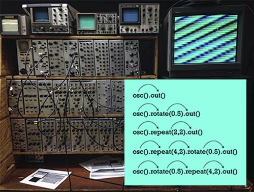

# Hydra Study

## Table of Contents

- [Hydra Study](#hydra-study)
  - [Table of Contents](#table-of-contents)
  - [Materials](#materials)
  - [Documentation](#documentation)
    - [Getting Started](#getting-started)
      - [hydra ? + 목적](#hydra---목적)
      - [코드 작성해보기](#코드-작성해보기)
      - [코드 운영해보기](#코드-운영해보기)
  - [Results](#results)

## Materials

- [hydra github](https://github.com/hydra-synth/hydra)
- [hydra documentation](https://hydra.ojack.xyz/docs/#/)
- [hydra API documentation](https://hydra.ojack.xyz/api/)

## Documentation

### [Getting Started](https://hydra.ojack.xyz/docs/#/getting_started)

#### hydra ? + 목적

- hydra는 웹에서 간단하게 라이브 코딩을 해볼 수 있는 툴!
- 특별한 문법을 배우지 않아도 쉽고 간단하게 코드를 작성해서 아름다운 비주얼을 만들어볼 수 있다는 것이 특장점이다! (스크린 화면, 오디오, 카메라 등의 다양한 인풋 소스들도 활용해볼 수 있다.)
- 기본적인 코드 작성법과 라이브로 비디오와 같은 여타의 소스들을 믹싱하는 방법을 알아보자 🔎

#### 코드 작성해보기

- hydra는 어떻게 운영되는 것일까?
- 

  - **딱 기본만 알고가기**

    - 자바스크립트에서의 function?

    ```
    function osc() {
      function modulate() {
        return something
      }
      ...

      return {
        osc,
        modulate,
        ...
      }
    }
    ```

    - 어떻게 hydra는 자바스크립트를 활용해서 쉽고 간편한 코드 구성을 짜냈을까?
      - 자바스크립트의 Closures 기능/문법 을 통해서 구현했다.
      - 함수안에 또 다른 함수를 저장해 놓음으로서, 함수들이 꼬리에 꼬리를 물 수 있도록 제작되었다.
      - [_Hydra function api 참고_](https://hydra.ojack.xyz/api/)

#### 코드 운영해보기

- control + shift + enter => 화면 상의 코드를 실행해준다.
- 기본적인 코드의 구성은 Resource로 시작해서, Out으로 끝나야 한다.
  - Resource는 아주 다양한 것들이 입력될 수 있다.
  - 마이크, 스크린 캡쳐, 카메라 ... 지금 당장 웹에서 자연스럽게 꺼내들 수 있는 모든 것들!
  - **라이브로 운용을 하고자 할 때는 Resource -> Out의 한 줄기를 하나의 비주얼로 생각하고 실행시키면 된다.**
    - 완결된 비주얼을 구성해주는 코드를 선택한 뒤에 control + enter를 누르면 해당 줄만 코드가 실행된다.
    - 음악이나, 입맛에 맞게 비주얼을 만들어서 선택 -> 실행을 하면서 운용할 수 있다.
- Hydra에서 제공해주는 render() 함수를 통해서 화면 패널을 4개까지 분리하여 운용할 수 있다.
  - 분리하여 운용할 때는 제작된 이미지가 어떤 위치에서 랜더링 될 것인지도 함께 명시를 해주어야 한다.

## Results
